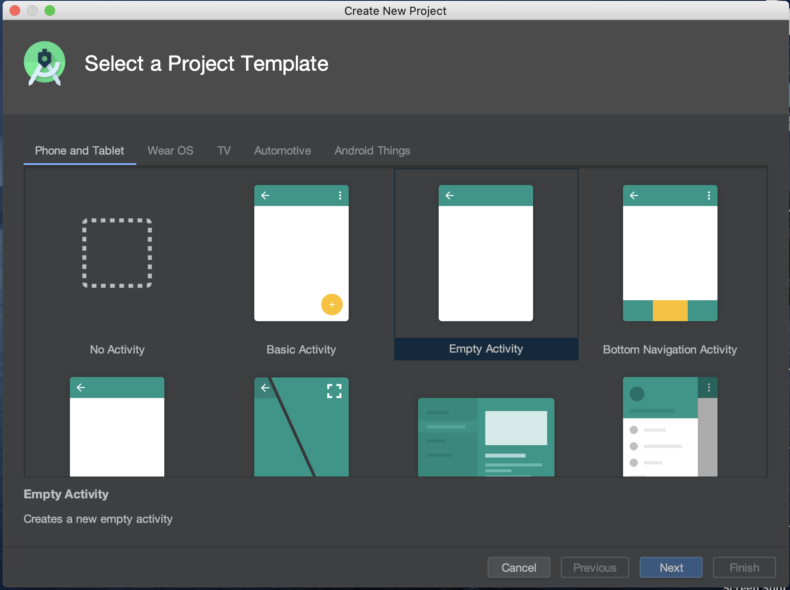
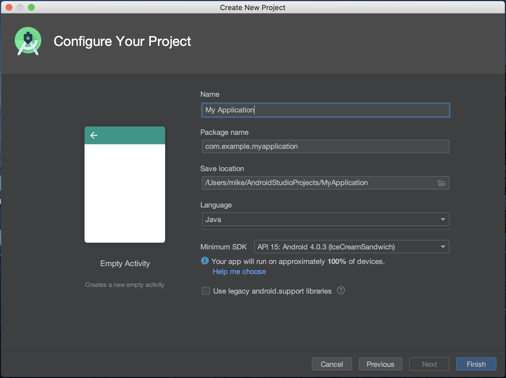
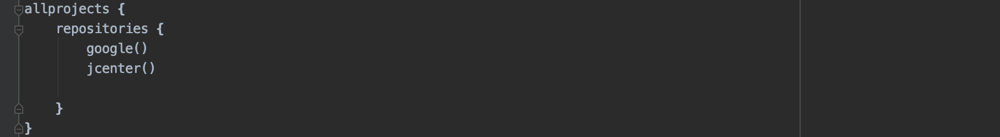

# Intro to Android

## What Is Android
Android is a mobile operating system based on a modified version of the Linux kernel and other open source software, designed primarily for touchscreen mobile devices such as smartphones and tablets. It was first unveiled in 2007 with the first commercial Android device launched in 2008. Note that it is a __free and open source__ software. Its sourcecode is called Android Open Source Project (AOSP) which is primarily licensed under the [Apache License](https://en.wikipedia.org/wiki/Apache_License).

## Procedures For Creating an App
1. Open Android Studio and click start a new android project
2. Choose an activity template from the given templates

3. Enter the name of your application, package name(use the default company domain or create your own company domain), save location, and your prefered language(Kotlin or Java). Choose the minimum SDK version that your app supports. Normally __API 15: Android 4.0.3 (IceCreamSandwich)__ is selected by default. This will ensure that your app will run on almost 100% of devices.

## App Structure
Viewing the app in the standard Android project hierarchy, one sees an app folder and a Gradle Scripts folder. Under the app folder, there is a __manifests__ folder, a __java__ folder, and a __res__ folder. 

### The manifests folder
The manifests folder contains files that provide essential information about your app to the Android system, which the system must have before it can run any of the app's code. Inside the manifests folder, there is a AndroidMnifests.xml file. This file describes all components of your android app. You must declare all components of your app in this file, such as __Activity__ and __what kinds of implicit intents to handle__. 

### The java folder
The java folder contains three subfolders. The first folder contains all the java class files for the app package. The other two are used for testing. the MainActivity.java file is already included in the first folder. Main activity is the name of the first activity (screen) the user sees, which also initializes app-wide resources, is customarily called __MainActivity__ (the file extension is omitted in the __Project > Android pane__).

### The res folder
The res (resource) folder holds resources, such as layouts, strings, and images. An Activity is usually associated with a layout of UI views defined as an XML file. This file is usually named after its Activity.

### The Gradle Scripts folder
Simply put, [Gradle](https://docs.gradle.org/current/userguide/what_is_gradle.html) is an open-source build automation tool that is designed to be flexible enough to build almost any type of software.  
The __build.gradle(Project: [project name])__ file contains the configuration options that are common to all of the modules that make up your project. This is the single, top level gradle build file that every Android Studio Project has. By default, the top-level build file uses the buildscript block to define the Gradle repositories and dependencies that are common to all modules in the project. When your dependency is something other than a local library or file tree, Gradle looks for the files in whichever online repositories are specified in the repositories block of this file. By default, new Android Studio projects declare JCenter and Google (which includes the Google Maven repository) as the repository locations:

Each module also has its own build.gradle file which allows you to configure build settings for the sepcific module, such as custom packaging options or additional build types.  
The __build.gradle(Module: app)__ is the file you edit when changing app level configurations. You can add __dependencies__ or change the __TargetSdkVersion__ of the app and so on.

